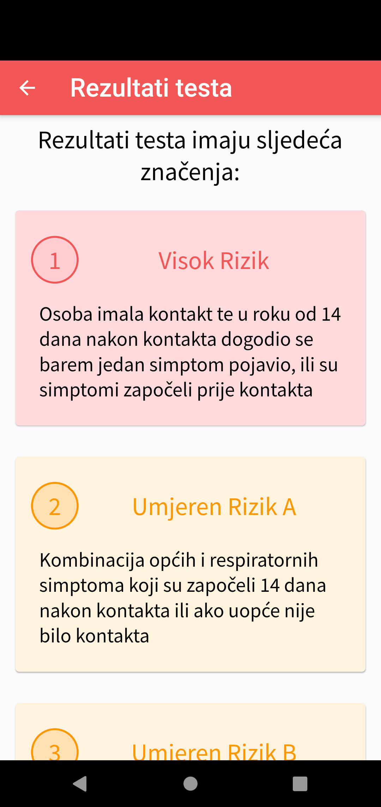
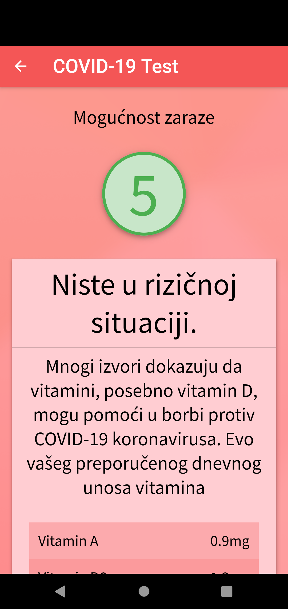

  

  <h3 align="center">Riskfactor</h3>

  

    A simple app for tracking and advising on COVID-19.
     
    <a href="https://github.com/mapokapo/riskfactor/blob/master/slike">View Screenshots</a>
    ·
    <a href="https://github.com/mapokapo/riskfactor/issues">Report Bug</a>
    ·
    <a href="https://github.com/mapokapo/riskfactor/issues">Request Feature</a>
  

  
<h2 style="display: inline-block">Table of Contents</h2>

  <ol>
    <li>
      <a href="#about-the-project">About The Project</a>
      <ul>
        <li><a href="#built-with">Built With</a></li>
      </ul>
    </li>
    <li><a href="#application-structure">Application Structure</a></li>
    <li><a href="#features">Features</a></li>
    <li><a href="#code-overview">Code Overview</a></li>
    <li><a href="#contact">Contact</a></li>
  </ol>

## About The Project

  
  
  

Riskfactor is an application designed to provide secure and seamless testing, tracking, and action recommendations related to COVID-19. 

Using the app, users can log in via a form requiring basic information and complete a test that calculates their risk of infection. The app then suggests recommended steps if there’s a higher likelihood of infection. 

The infection risk is measured using a numeric system representing the user's health status, ranging from 5 (minimal risk) to 1 (advanced symptoms of COVID-19). 

In the case of infection, Riskfactor offers an easy way to contact nearby medical facilities or emergency services.

### Built With

- [Flutter](https://flutter.dev/)

## Application Structure

The app uses the default structure of Flutter applications. Most of the code is located in the `lib/pages/` folder, which contains the individual screens of the app.

## Features

- **Login and Dashboard**: Log in via a form and view your data on the dashboard.  
- **COVID-19 Test**: Start a test via a button on the dashboard to calculate your risk and receive recommended steps.  
- **Additional Information and Contacts**: Access extra information or contact medical services directly.  
- **Theme Switching**: Use the menu in the top-left corner to switch between light and dark modes.  
- **Settings and Logout**: Access additional settings or log out via the menu.

## Code Overview

The code is written following the recommended practices for Flutter applications. Different parts of the app are separated into folders whose names describe their functionality.

## Contact

Leo Petrovic - leopetrovic11@gmail.com

Project Link: [https://github.com/mapokapo/riskfactor](https://github.com/mapokapo/riskfactor)
